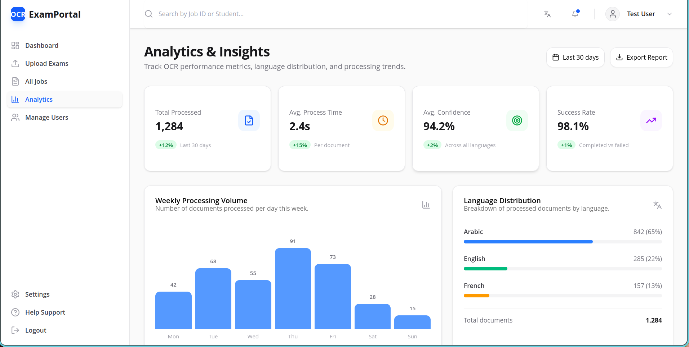

# 📝 Multilingual Handwritten Exam OCR System

An enterprise-grade, full-stack OCR solution for extracting handwritten student answers from scanned exam sheets. The system combines **EasyOCR** for text detection with **Google Gemini LLM** for intelligent structuring — supporting **Arabic** (primary), **French**, and **English** handwritten text while strictly preserving the authenticity and integrity of the original student content.



---

## 🎯 Challenge Objective

Design and implement a robust OCR pipeline that:

- Detects and processes scanned handwritten exam sheets
- Accurately extracts student answers in Arabic (primary focus), French, and English
- Preserves the **exact wording, spelling, and formatting** of the student's response
- Avoids hallucination, auto-correction, paraphrasing, or content enhancement
- Maintains alignment between extracted answers and their corresponding questions
- Handles variable writing styles, noise, skewed scans, and mixed-language responses

---

## 🏗️ Architecture Overview

The system is composed of **7 Docker services** orchestrated via Docker Compose:

```
┌─────────────────────────────────────────────────────────┐
│                    Nginx (Port 80)                       │
│              Reverse Proxy & Load Balancer               │
├──────────────────────┬──────────────────────────────────┤
│                      │                                   │
│  Frontend (Next.js)  │      Backend API (FastAPI)        │
│  React 19 + i18n     │      Auth + Jobs + Upload         │
│  Tailwind + shadcn   │      SQLAlchemy + PostgreSQL      │
│                      │                                   │
├──────────────────────┴──────────────────────────────────┤
│                                                          │
│  ┌──────────┐  ┌─────────────┐  ┌────────────────────┐  │
│  │ PostgreSQL│  │    Redis    │  │   Celery Worker    │  │
│  │   (DB)   │  │  (Broker)   │  │  (Task Processing) │  │
│  └──────────┘  └─────────────┘  └────────┬───────────┘  │
│                                           │              │
│                                  ┌────────▼───────────┐  │
│                                  │   AI Service        │  │
│                                  │  EasyOCR + Gemini   │  │
│                                  └────────────────────┘  │
└──────────────────────────────────────────────────────────┘
```

| Service | Technology | Purpose |
|---------|-----------|---------|
| **Frontend** | Next.js 16, React 19, Tailwind 4, shadcn/ui | Multilingual dashboard (AR/EN/FR) with upload, jobs tracking, analytics |
| **Backend** | FastAPI, SQLAlchemy (async), PostgreSQL | REST API for auth, job management, file upload |
| **Worker** | Celery + Redis | Async background OCR task processing |
| **AI Service** | EasyOCR + LangChain + Google Gemini 1.5 Flash | Text detection, extraction, and LLM-based structuring |
| **Database** | PostgreSQL 15 | Persistent storage for users, jobs, and extractions |
| **Redis** | Redis 7 | Message broker for Celery task queue |
| **Nginx** | Nginx (stable-alpine) | Reverse proxy routing traffic to frontend and backend |

---

## 🔧 Tech Stack

### Backend
- **FastAPI** — High-performance async Python API framework
- **SQLAlchemy 2.0** — Async ORM with PostgreSQL (asyncpg driver)
- **Alembic** — Database migrations
- **Celery** — Distributed task queue for OCR processing
- **Redis** — Task broker and result backend
- **python-jose** — JWT token authentication
- **passlib + bcrypt** — Secure password hashing
- **httpx** — Async HTTP client for AI service communication

### AI / OCR Service
- **EasyOCR** — Deep learning OCR engine supporting Arabic, English, French
- **OpenCV** — Image preprocessing and manipulation
- **Pillow** — Image format handling
- **LangChain** — LLM orchestration framework
- **Google Gemini 1.5 Flash** — LLM for structuring raw OCR output into Q&A pairs
- **PyTorch (CPU)** — Neural network runtime for EasyOCR

### Frontend
- **Next.js 16.1.6** — React framework with App Router
- **React 19** — UI library
- **next-intl 4.8** — Internationalization (Arabic RTL, English, French)
- **TanStack React Query** — Server state management with auto-polling
- **Tailwind CSS 4** — Utility-first styling
- **shadcn/ui (Radix)** — Accessible UI component library
- **react-dropzone** — Drag & drop file upload
- **react-hook-form + Zod** — Form validation
- **Axios** — HTTP client with interceptors
- **Lucide React** — Icon library

### Infrastructure
- **Docker Compose** — Multi-service orchestration
- **Nginx** — Reverse proxy (API + Frontend on port 80)
- **PostgreSQL 15** — Relational database
- **Redis 7** — In-memory cache and message broker

---

## 🚀 Getting Started

### Prerequisites

- **Docker** and **Docker Compose** installed
- **Google API Key** for Gemini LLM (optional — fallback mode works without it)

### 1. Clone the Repository

```bash
git clone https://github.com/Aymen-Falleh/ocr_exam_correction.git
cd ocr_exam_correction
```

### 2. Set Environment Variables

Create a `.env` file in the project root:

```env
GOOGLE_API_KEY=your_google_gemini_api_key_here
```

> If no API key is provided, the AI service will fall back to raw OCR extraction without LLM structuring.

### 3. Build and Start All Services

```bash
docker compose up -d --build
```

This starts all 7 services. The first build may take several minutes (EasyOCR + PyTorch downloads).

### 4. Access the Application

Open your browser and navigate to:

```
http://localhost
```

### 5. Default Login Credentials

| Field | Value |
|-------|-------|
| Email | `test@example.com` |
| Password | `Test1234!` |
| Role | Admin |

> New users can be created via the **User Management** page (admin only) or the `/api/v1/auth/register` endpoint.

---

## 📋 Features

### Authentication & Security
- JWT-based authentication with 7-day token expiry
- OAuth2 password flow with bcrypt password hashing
- Role-based access control (Admin / Teacher)
- Protected API routes with bearer token middleware

### Document Upload & OCR Processing
- Drag & drop file upload (PDF, JPG, PNG — max 10MB)
- **Language selector** — choose Arabic, English, or French before processing
- **Real-time progress tracking** — animated progress bar with processing step indicators
- Asynchronous OCR processing via Celery workers (non-blocking)
- Automatic polling for job status updates every 3 seconds

### OCR Pipeline
1. **Image Preprocessing** — File validation and format conversion
2. **EasyOCR Detection** — Deep learning text region detection with bounding boxes
3. **LLM Structuring** — Gemini 1.5 Flash organizes raw OCR text into Question-Answer pairs
4. **Fallback Mode** — If LLM is unavailable, raw OCR results are returned as-is
5. **Result Storage** — Extractions saved with confidence scores, bounding boxes, and metadata

### Results & Analytics
- Per-job extraction viewer with confidence color coding (green >90%, amber >70%, red below)
- Inline results preview after OCR completes on the upload page
- Stats cards showing total extractions, average confidence, files processed
- Job detail page with extracted data table
- Dashboard with overview stats and recent activity

### Internationalization (i18n)
- Full RTL support for Arabic (`ar`)
- English (`en`) and French (`fr`) translations
- Language switcher in the UI
- All UI text externalized in JSON translation files

### Dashboard Pages
| Page | Route | Description |
|------|-------|-------------|
| Dashboard | `/dashboard` | Overview stats, recent jobs, performance metrics |
| Upload | `/dashboard/upload` | File upload with OCR workflow |
| Jobs List | `/dashboard/jobs` | All OCR jobs with filtering and search |
| Job Detail | `/dashboard/jobs/[id]` | Detailed extraction results for a specific job |
| Analytics | `/dashboard/analytics` | Processing trends, language distribution, confidence metrics |
| User Management | `/dashboard/users` | Create and manage system users (admin only) |
| Settings | `/dashboard/settings` | Profile, OCR preferences, notification settings |
| Help | `/dashboard/help` | Documentation, FAQ, and support info |

---

## 📁 Project Structure

```
.
├── docker-compose.yml          # Multi-service orchestration
├── nginx/
│   └── default.conf            # Reverse proxy configuration
│
├── backend/                    # FastAPI Backend
│   ├── Dockerfile
│   ├── requirements.txt
│   ├── alembic.ini             # Database migration config
│   ├── alembic/
│   │   └── env.py
│   ├── app/
│   │   ├── main.py             # FastAPI app entry, CORS, lifespan
│   │   ├── api/
│   │   │   ├── auth.py         # Login, register, /me endpoints
│   │   │   ├── jobs.py         # Upload, list, get job endpoints
│   │   │   └── deps.py         # Dependency injection (auth, DB)
│   │   ├── core/
│   │   │   ├── config.py       # Settings (DB, Redis, JWT, CORS)
│   │   │   └── security.py     # JWT creation, password hashing
│   │   ├── db/
│   │   │   ├── models.py       # SQLAlchemy models (User, Job, Extraction)
│   │   │   └── session.py      # Async database session factory
│   │   ├── schemas/            # Pydantic request/response models
│   │   │   ├── job.py
│   │   │   ├── token.py
│   │   │   └── user.py
│   │   └── worker/
│   │       ├── celery_app.py   # Celery configuration
│   │       └── tasks.py        # OCR processing task
│   ├── data/
│   │   ├── samples/            # Sample exam sheets
│   │   └── uploads/            # Uploaded files storage
│   └── tests/
│       ├── conftest.py
│       ├── api/                # API integration tests
│       └── unit/               # Unit tests
│
├── ai-service/                 # AI OCR Microservice
│   ├── Dockerfile
│   ├── requirements.txt
│   └── app/
│       ├── main.py             # FastAPI app with /process endpoint
│       └── services/
│           ├── ocr_service.py  # EasyOCR text extraction
│           └── llm_service.py  # Gemini LLM structuring
│
├── frontend/                   # Next.js Frontend
│   ├── Dockerfile
│   ├── package.json
│   ├── next.config.ts
│   ├── tsconfig.json
│   ├── messages/               # i18n translations
│   │   ├── ar.json             # Arabic
│   │   ├── en.json             # English
│   │   └── fr.json             # French
│   └── src/
│       ├── middleware.ts        # Next.js locale routing middleware
│       ├── app/
│       │   └── [locale]/       # Locale-aware routes
│       │       ├── (auth)/     # Login page
│       │       └── (dashboard)/ # Protected dashboard pages
│       ├── components/
│       │   ├── ui/             # shadcn/ui components
│       │   ├── dashboard/      # Dashboard components
│       │   └── upload/         # Upload dropzone & guidelines
│       ├── hooks/              # Custom React hooks (useAuth, useJob, useJobs)
│       ├── i18n/               # Internationalization config
│       ├── lib/                # Axios client, utils, validations
│       └── providers/          # TanStack Query provider
│
└── screenshots/                # Application screenshots
    ├── Screenshot_2026-02-28_07-03-35.png
    ├── Screenshot_2026-02-28_07-03-50.png
    ├── Screenshot_2026-02-28_07-04-01.png
    ├── Screenshot_2026-02-28_07-04-21.png
    └── Screenshot_2026-02-28_07-05-16.png
```

---

## 🔌 API Endpoints

### Authentication
| Method | Endpoint | Description |
|--------|----------|-------------|
| `POST` | `/api/v1/auth/register` | Register a new user |
| `POST` | `/api/v1/auth/login` | Login (OAuth2 password flow) |
| `GET` | `/api/v1/auth/me` | Get current authenticated user |

### Jobs
| Method | Endpoint | Description |
|--------|----------|-------------|
| `POST` | `/api/v1/jobs/upload` | Upload a file and create an OCR job |
| `GET` | `/api/v1/jobs/` | List all jobs for the current user |
| `GET` | `/api/v1/jobs/{id}` | Get job details with extractions |

### AI Service (Internal)
| Method | Endpoint | Description |
|--------|----------|-------------|
| `POST` | `/process` | Process a document through OCR + LLM pipeline |
| `GET` | `/health` | Health check |

---

## 🖼️ Screenshots

All screenshots are located in the [`screenshots/`](screenshots/) folder:

| Screenshot | Description |
|------------|-------------|
| `Screenshot_2026-02-28_07-03-35.png` | Main application view |
| `Screenshot_2026-02-28_07-03-50.png` | Application interface |
| `Screenshot_2026-02-28_07-04-01.png` | Application interface |
| `Screenshot_2026-02-28_07-04-21.png` | Application interface |
| `Screenshot_2026-02-28_07-05-16.png` | Application interface |

---

## ⚙️ Configuration

### Environment Variables

| Variable | Service | Default | Description |
|----------|---------|---------|-------------|
| `GOOGLE_API_KEY` | ai-service | — | Google Gemini API key for LLM structuring |
| `POSTGRES_SERVER` | backend/worker | `db` | PostgreSQL hostname |
| `POSTGRES_USER` | backend/worker | `postgres` | Database user |
| `POSTGRES_PASSWORD` | backend/worker | `postgres` | Database password |
| `POSTGRES_DB` | backend/worker | `ocr_db` | Database name |
| `REDIS_HOST` | backend/worker | `redis` | Redis hostname |
| `SECRET_KEY` | backend/worker | auto-generated | JWT signing secret |
| `NEXT_PUBLIC_API_URL` | frontend | `/api/v1` | Backend API base URL |

---

## 🧪 Testing

### Backend Tests
```bash
docker compose exec backend pytest tests/ -v
```

### Frontend Tests
```bash
docker compose exec frontend npm test
```

### E2E Tests (Playwright)
```bash
docker compose exec frontend npx playwright test
```

---

## 🛠️ Development

### Running Locally (without Docker)

**Backend:**
```bash
cd backend
pip install -r requirements.txt
uvicorn app.main:app --reload --port 8000
```

**AI Service:**
```bash
cd ai-service
pip install -r requirements.txt
uvicorn app.main:app --reload --port 8001
```

**Frontend:**
```bash
cd frontend
npm install --legacy-peer-deps
npm run dev
```

**Celery Worker:**
```bash
cd backend
celery -A app.worker.celery_app worker --loglevel=info
```

---

## 📄 License

This project was developed as part of the **AI Night Challenge** — a hackathon focused on building practical AI solutions for education.
